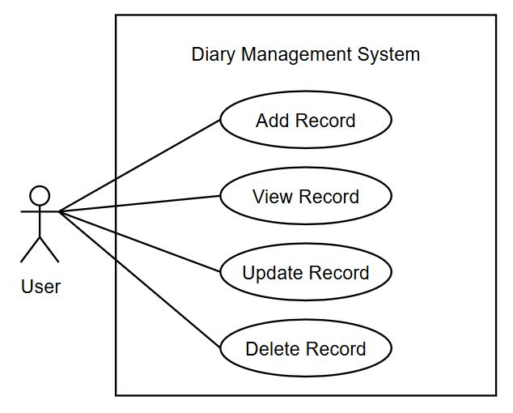
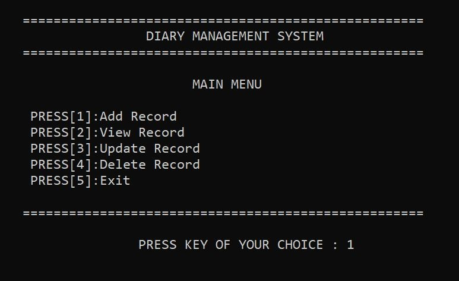
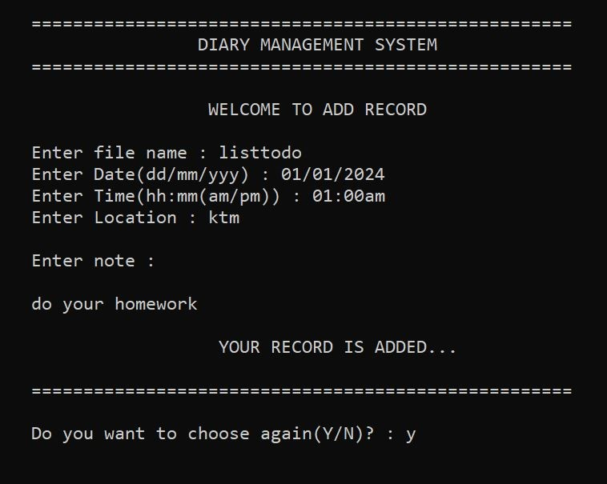
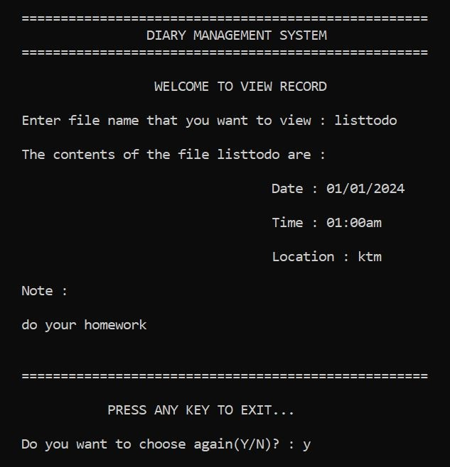
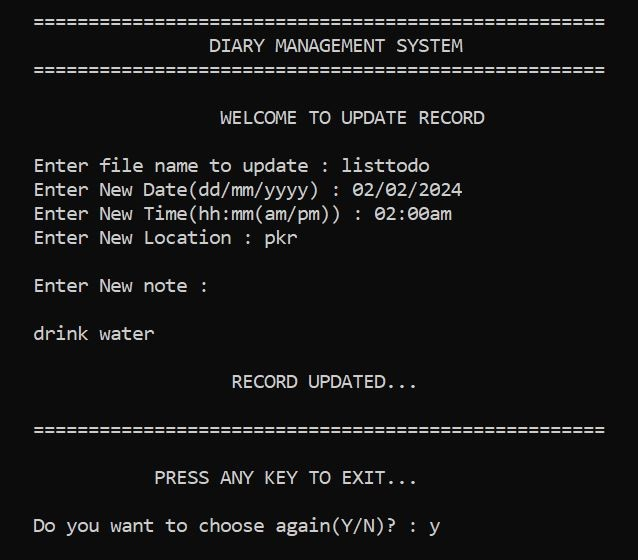
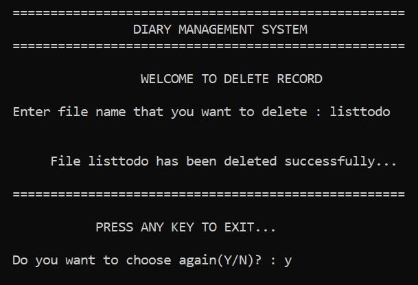
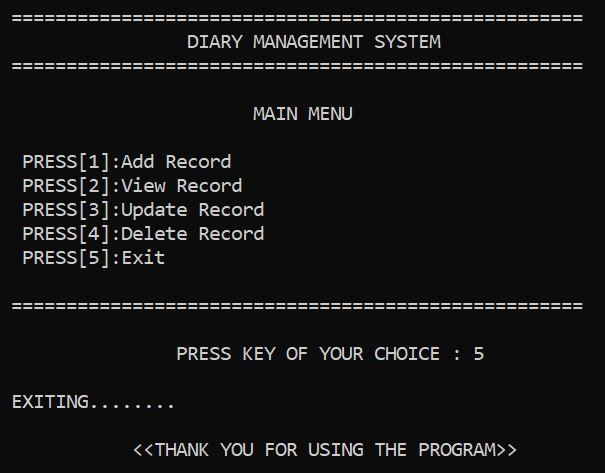

# Diary Management System

## Abstract

The **Diary Management System** is a console-based application developed in **C** that helps users organize and manage daily tasks, reminders, and personal notes.

## Table of Contents

- [Problem Statement](#problem-statement)
- [Objective](#objective)
- [Use Case Diagram](#use-case-diagram)
- [Screenshots](#screenshots)
- [Demo Video](#demo-video)
- [Conclusion](#conclusion)

## Problem Statement

- **Managing Daily Tasks is Difficult**  
    People often struggle to keep track of their schedules, tasks, and reminders effectively.  

- **Traditional Diaries Are Inconvenient**  
    Pen-and-paper diaries are not easily organized, searchable, or portable.  

- **Important Information Can Be Lost**  
    Physical records can be damaged, lost, or forgotten, making it hard to stay organized.

## Objective

To develop a user-friendly Diary Management System that allows users to efficiently organize and manage daily tasks, reminders, and personal notes through a simple console-based interface.

## Use Case Diagram

## Screenshots

> Below are some screenshots of Diary Management System:

## Demo Video

> Watch the working demo of Diary Management System by clicking the image below:

## Conclusion

The Diary Management System provides an easy and efficient way to organize daily tasks, reminders, and personal notes. It replaces traditional diaries, offering improved accessibility, organization, and record keeping.

## Contact Me

Created by [Nitika Maharjan](https://github.com/NitikaMaharjan)  
Email: [maharjanitika@gmail.com](https://mail.google.com/mail/?view=cm&fs=1&to=maharjanitika@gmail.com) 

Feel free to connect on GitHub or reach out via email for collaboration!